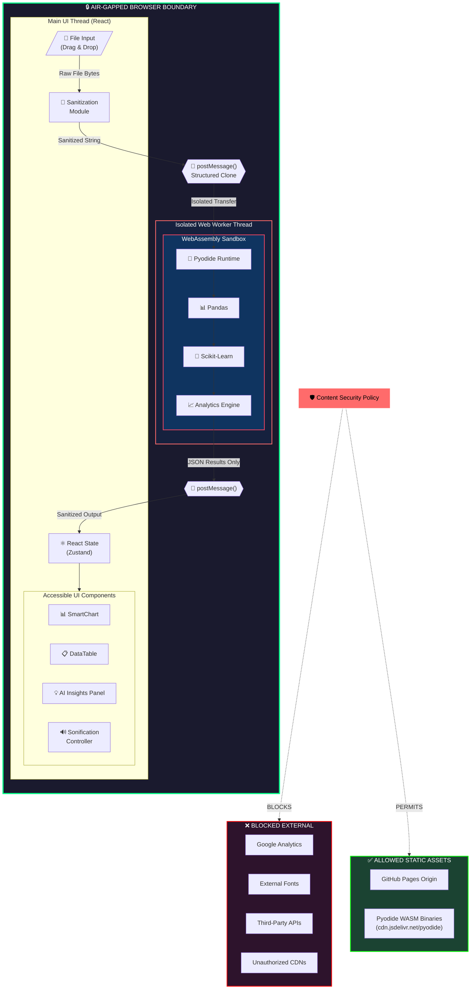
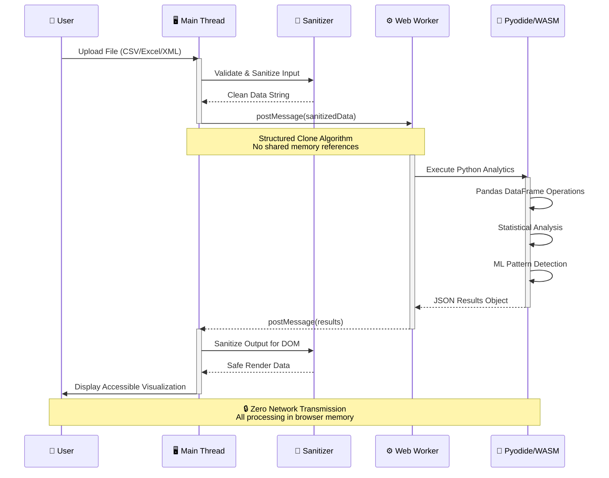
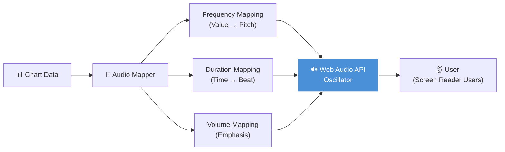

# PRISM - Technical Design Document (TDD)
## Browser-Based, Serverless Data Analytics & Visualization Platform

**Document Version:** 1.0.0  
**Classification:** Internal - Architectural Blueprint  
**Last Updated:** January 24, 2026  
**Author:** Principal Architecture Team

---

## Table of Contents

1. [Executive Summary](#1-executive-summary)
2. [Compliance Matrix](#2-compliance-matrix)
3. [System Architecture](#3-system-architecture)
4. [Security Architecture](#4-security-architecture)
5. [Accessibility Architecture](#5-accessibility-architecture)
6. [Data Flow Specification](#6-data-flow-specification)
7. [Component Specifications](#7-component-specifications)
8. [Risk Assessment](#8-risk-assessment)

---

## 1. Executive Summary

### 1.1 Mission Statement

PRISM is a **zero-trust, client-side data analytics platform** designed for processing sensitive datasets (Excel, XML, CSV) entirely within the browser environment. The system guarantees **data sovereignty** by ensuring **0 bytes of user data** are transmitted over any network boundary.

### 1.2 Core Principles

| Principle | Implementation |
|-----------|----------------|
| **Zero Trust** | Browser treated as hostile; all inputs sanitized |
| **Air-Gapped Processing** | WebAssembly compute isolation via Web Workers |
| **Universal Access** | WCAG 2.2 AAA compliance with sonification support |
| **Privacy by Design** | GDPR Art 32 / PIPEDA compliant architecture |

---

## 2. Compliance Matrix

### 2.1 Standards Mapping

| Standard | Requirement | PRISM Implementation |
|----------|-------------|---------------------|
| **ISO/IEC 40500:2025** | WCAG 2.2 Level AAA | Sonification, table fallbacks, 7:1 contrast ratios |
| **EN 301 549** | UI contrast & font sizing | TailwindCSS high-contrast theme, min 16px base |
| **ISO/IEC 27001:2022** | Information security | CSP headers, input sanitization, isolated compute |
| **GDPR Article 32** | Security of processing | Client-side only, no data transmission |
| **PIPEDA** | Canadian privacy law | Zero data collection, no third-party services |
| **OWASP Top 10** | Web security standards | DOM XSS prevention, strict CSP |

---

## 3. System Architecture

### 3.1 Architecture Diagram



### 3.2 Thread Isolation Model



---

## 4. Security Architecture

### 4.1 Threat Model

| Threat Vector | Risk Level | Mitigation |
|---------------|------------|------------|
| DOM-based XSS | Critical | DOMPurify sanitization, CSP script-src |
| Data Exfiltration | Critical | CSP connect-src 'none', no fetch/XHR |
| Supply Chain Attack | High | Subresource Integrity (SRI), pinned deps |
| Malicious File Upload | High | File type validation, size limits, magic byte checks |
| Worker Thread Escape | Medium | Structured clone isolation, no SharedArrayBuffer |

### 4.2 Content Security Policy (Strict)

```html
<meta http-equiv="Content-Security-Policy" content="
    default-src 'none';
    script-src 'self' 'wasm-unsafe-eval' https://cdn.jsdelivr.net/pyodide/;
    style-src 'self' 'unsafe-inline';
    img-src 'self' data: blob:;
    font-src 'self';
    connect-src 'self' https://cdn.jsdelivr.net/pyodide/;
    worker-src 'self' blob:;
    frame-src 'none';
    object-src 'none';
    base-uri 'self';
    form-action 'none';
    frame-ancestors 'none';
    upgrade-insecure-requests;
">
```

### 4.3 Defense Layers

```
┌─────────────────────────────────────────────────────────────┐
│  Layer 1: Content Security Policy (Network Boundary)        │
├─────────────────────────────────────────────────────────────┤
│  Layer 2: Input Validation (File Type & Size Guards)        │
├─────────────────────────────────────────────────────────────┤
│  Layer 3: DOMPurify Sanitization (XSS Prevention)           │
├─────────────────────────────────────────────────────────────┤
│  Layer 4: Web Worker Isolation (Thread Boundary)            │
├─────────────────────────────────────────────────────────────┤
│  Layer 5: WebAssembly Sandbox (Memory Isolation)            │
├─────────────────────────────────────────────────────────────┤
│  Layer 6: Output Sanitization (Safe DOM Rendering)          │
└─────────────────────────────────────────────────────────────┘
```

---

## 5. Accessibility Architecture

### 5.1 WCAG 2.2 AAA Compliance Matrix

| WCAG Criterion | Level | Implementation |
|----------------|-------|----------------|
| 1.1.1 Non-text Content | A | Alt text, ARIA labels, table fallbacks |
| 1.3.1 Info & Relationships | A | Semantic HTML, programmatic labels |
| 1.4.1 Use of Color | A | Patterns, textures in charts |
| 1.4.3 Contrast (Minimum) | AA | 4.5:1 ratio enforced |
| 1.4.6 Contrast (Enhanced) | AAA | **7:1 ratio enforced** |
| 1.4.10 Reflow | AA | Responsive to 320px width |
| 1.4.12 Text Spacing | AA | User-adjustable spacing |
| 2.1.1 Keyboard | A | Full keyboard navigation |
| 2.1.3 Keyboard (No Exception) | AAA | **All functions keyboard accessible** |
| 2.4.7 Focus Visible | AA | High-contrast focus indicators |
| 4.1.2 Name, Role, Value | A | ARIA attributes on all controls |

### 5.2 Sonification Strategy



---

## 6. Data Flow Specification

### 6.1 File Processing Pipeline

```
┌──────────────┐    ┌──────────────┐    ┌──────────────┐    ┌──────────────┐
│   FILE       │    │   VALIDATE   │    │   PARSE      │    │   ANALYZE    │
│   INPUT      │───▶│   & GUARD    │───▶│   (Worker)   │───▶│   (Pyodide)  │
└──────────────┘    └──────────────┘    └──────────────┘    └──────────────┘
       │                   │                   │                   │
       ▼                   ▼                   ▼                   ▼
   Drag/Drop         Size < 50MB          CSV Parser          Pandas DF
   File API          Magic Bytes          XLSX Parser         Statistics
   Click Upload      Extension Check      XML Parser          ML Insights
                                                                   │
┌──────────────┐    ┌──────────────┐    ┌──────────────┐          │
│   RENDER     │◀───│   SANITIZE   │◀───│   TRANSFORM  │◀─────────┘
│   (React)    │    │   OUTPUT     │    │   RESULTS    │
└──────────────┘    └──────────────┘    └──────────────┘
       │                   │                   │
       ▼                   ▼                   ▼
   SmartChart         DOMPurify          JSON Schema
   DataTable          HTML Escape        Validation
   AI Summary         Type Coercion      Structure Check
```

### 6.2 State Management

```typescript
interface PrismState {
  // File State
  file: {
    raw: ArrayBuffer | null;
    name: string;
    type: 'csv' | 'xlsx' | 'xml' | null;
    size: number;
    validationStatus: 'pending' | 'valid' | 'invalid';
  };
  
  // Processing State
  processing: {
    status: 'idle' | 'parsing' | 'analyzing' | 'complete' | 'error';
    progress: number; // 0-100
    error: string | null;
  };
  
  // Results State
  results: {
    statistics: StatisticalSummary | null;
    recommendations: VisualizationRecommendation[];
    insights: AIInsight[];
  };
  
  // Accessibility State
  accessibility: {
    highContrast: boolean;
    reducedMotion: boolean;
    sonificationEnabled: boolean;
    fontSize: 'normal' | 'large' | 'x-large';
  };
}
```

---

## 7. Component Specifications

### 7.1 Component Hierarchy

```
src/
├── components/
│   ├── core/
│   │   ├── FileUploader/          # Accessible drag-drop zone
│   │   ├── ProcessingIndicator/   # ARIA live region for status
│   │   └── ErrorBoundary/         # Graceful error handling
│   │
│   ├── visualization/
│   │   ├── SmartChart/            # Main accessible chart component
│   │   ├── ChartSonifier/         # Web Audio sonification
│   │   ├── DataTableFallback/     # Screen reader table
│   │   └── InsightSummary/        # AI-generated text insights
│   │
│   └── accessibility/
│       ├── SkipLinks/             # Skip navigation links
│       ├── FocusManager/          # Focus trap & management
│       └── AnnouncementRegion/    # ARIA live announcements
│
├── workers/
│   └── prism.worker.ts            # Pyodide Web Worker
│
├── python/
│   └── prism_core.py              # Analytics engine
│
├── security/
│   ├── sanitizer.ts               # DOMPurify wrapper
│   ├── validator.ts               # Input validation
│   └── csp.ts                     # CSP violation reporter
│
└── stores/
    └── prismStore.ts              # Zustand state management
```

---

## 8. Risk Assessment

### 8.1 Risk Register

| ID | Risk | Probability | Impact | Mitigation | Residual Risk |
|----|------|-------------|--------|------------|---------------|
| R1 | XSS via malformed file | Medium | Critical | Multi-layer sanitization | Low |
| R2 | Pyodide memory exhaustion | Medium | High | File size limits, chunking | Low |
| R3 | Accessibility regression | Low | High | Automated a11y testing (axe-core) | Very Low |
| R4 | CSP bypass via WASM | Low | Critical | Strict CSP, no unsafe-eval | Very Low |
| R5 | Browser compatibility | Medium | Medium | Feature detection, graceful degradation | Low |

### 8.2 Security Attestation

```
╔═══════════════════════════════════════════════════════════════════╗
║                    PRISM SECURITY ATTESTATION                      ║
╠═══════════════════════════════════════════════════════════════════╣
║  ✓ Zero network transmission of user data                         ║
║  ✓ All processing isolated in WebAssembly sandbox                 ║
║  ✓ Strict CSP blocks all unauthorized resources                   ║
║  ✓ Input/Output sanitization at all boundaries                    ║
║  ✓ No third-party analytics or tracking                           ║
║  ✓ No cookies, localStorage persistence of sensitive data         ║
║  ✓ OWASP Top 10 mitigations implemented                           ║
╚═══════════════════════════════════════════════════════════════════╝
```

---

## Appendix A: Revision History

| Version | Date | Author | Changes |
|---------|------|--------|---------|
| 1.0.0 | 2026-01-24 | Architecture Team | Initial release |

---

**END OF DOCUMENT**
